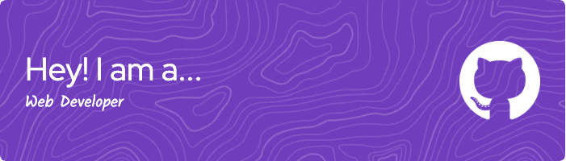

### Hi there 👋
### I'm Alvian Zachry Faturrahman
##### But you can call me Ary
-------

#### About Me
I'm Ary, a passionate technology enthusiast dedicated to fostering tech talent in Indonesia. My goal is to cultivate a thriving community of developers by collaborating on innovative projects. I'm particularly interested in React for frontend development, Golang for backend solutions, leveraging Python for data analysis, and exploring the versatility of Node.js.

#### ⚙️ Skills
| Programming Language | Proficiency |
|----------------------|-------------|
|  | Advanced |
|  | Advanced |
|  | Intermediate |
|  | Intermediate |
|  | Intermediate |

| Framework | Proficiency |
|-----------|-------------|
|  | Advanced |
|  | Advanced |
|  | Intermediate |
|  | Intermediate |

| Tools | Description |
|-------|-------------|
|  | GitHub, GitLab, CLI |
|  | Markdown, XHTML |
|  |  |
|  |  |
|  | Currently on Ubuntu 20 |

#### 🌱 What I'm Learning
I'm currently enhancing my skills in:
- 
- 
- 
- 🧹 Clean architecture

#### 🔭 What I'm Currently Working On
- [TiketQ](https://github.com/alvianzf/tiketq-api-gateway) - An API gateway that handles data from an external API.
- [Tick PHP](https://github.com/alvianzf/tick-php-framework) - My own lightweight PHP framework, developed from scratch as a side project.

#### 📫 How to Reach Me
You can connect with me on:
- 🔸 [GitHub](https://github.com/alvianzf)
- 🔗 [LinkedIn](https://linkedin.com/in/alvianzf)
- ✉️ Email: alvianzf@gmail.com
- 🐦 Twitter: @alvianzf
- 📊 Portfolio: [GitHub Page](https://alvianzf.github.io/)

#### 🚀 My GitHub Stats

#### 🤝 Let's Connect!
Feel free to explore my work and connect with me. Let's learn and grow together in the world of technology! 🌐
